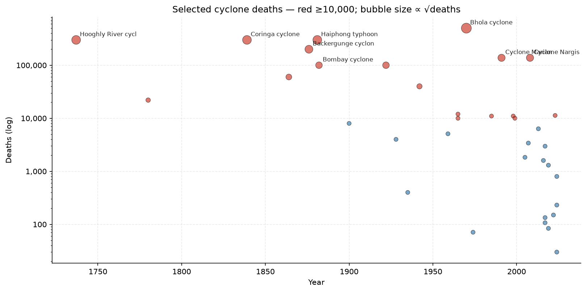
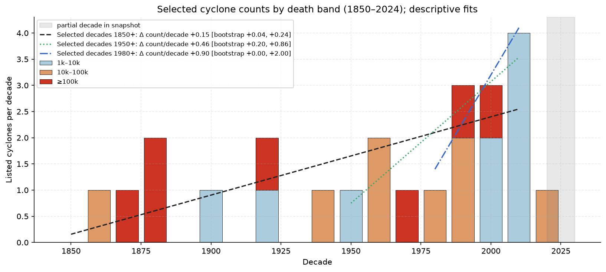
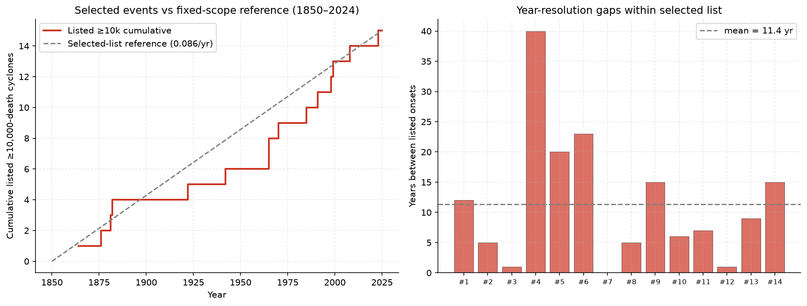
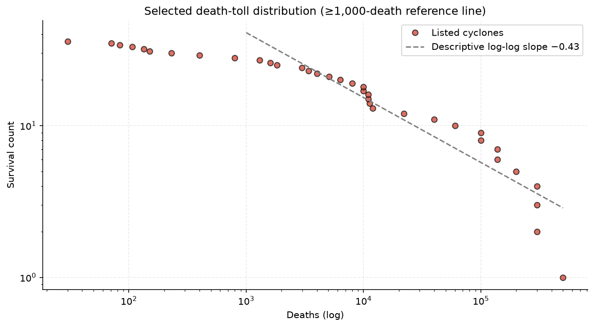

# tropical-cyclones

Selected historical cyclone events and descriptive plots. `cyclones.csv` contains **36 events spanning 1737–2024**, including **18 with reported deaths ≥10,000**. Most entries exceed 1,000 deaths; several lower-death events are included for context. This is a curated list, not a complete IBTrACS extract or a verified global mortality catalogue.

Part of the [`correlations`](https://github.com/Biblejustin/correlations) project.

## Reading the plots

Fatalities reflect storm characteristics, population exposure, preparedness, infrastructure and reporting. This list cannot separate those effects or establish that global cyclone frequency is rising, falling or flat. A high fatality threshold does not by itself establish historical completeness.

### Reported deaths over time

Each point represents a listed event with a positive mortality estimate. Red points have ≥10,000 reported deaths. The logarithmic axis accommodates the wide range of estimates; historical estimates remain uncertain.



### Selected counts by decade

Bars count listed events in three mortality bands. Lines describe the recorded counts across several historical subsets, excluding the partial 2020s decade. The legend reports the change in decadal count per elapsed decade and a bootstrap resampling range.

Resampling describes sensitivity within this selected dataset. It does not correct selection bias, establish surveillance completeness, or provide a global cyclone trend. Bootstrap samples containing only one distinct decade are excluded because their slope is undefined. Constant count samples have zero descriptive slope.



### Timing of listed ≥10,000-death events

The staircase includes qualifying entries within the fixed 1850–2024 snapshot scope. The straight reference uses that entire interval, including years after the last qualifying entry. The gap panel uses recorded onset years; two events in one year can have a zero year-resolution gap. These figures do not test global acceleration or steady-state frequency.



### Reported mortality distribution

The survival-count plot describes positive mortality estimates in the list. Its log-log line is a descriptive fit above 1,000 deaths. It does not establish a power-law population distribution or comparability with other disaster catalogues.



## Data and limitations

Columns: `year`, `month`, `name`, `region`, `deaths_estimate`, `sources_notes`. Month precision does not support exact-day coincidence tests. Missing mortality remains unknown.

The erroneous May 2003 “Cyclone Sidr” row was removed; the November 2007 Sidr entry remains. Original source notes are retained. Direct event-level citations, stable source identifiers and an independently assessed inclusion rule are still needed before this list can support stronger population claims.

Source references include [NOAA IBTrACS](https://www.ncei.noaa.gov/products/international-best-track-archive), national meteorological records, and EM-DAT/CRED mortality estimates. These references do not mean every listed estimate or the catalogue's completeness has been independently validated.

## Reproduce plots

```bash
python3 -m venv .venv
.venv/bin/pip install pandas numpy matplotlib
.venv/bin/python make_plots.py
```

Outputs are four PNGs under `plots/`. Empty, nonfinite or constant predictor inputs do not receive an undefined fitted slope.
